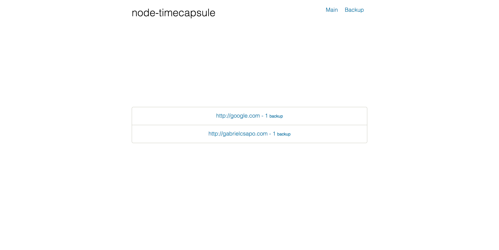
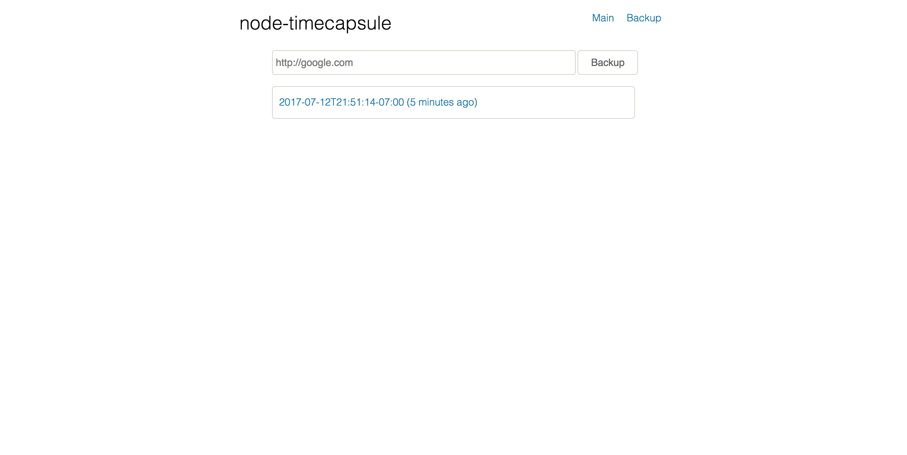

# node-timecapsule
[](https://www.npmjs.com/package/node-timecapsule)
[](https://david-dm.org/gabrielcsapo/node-timecapsule)
[](https://david-dm.org/gabrielcsapo/node-timecapsule#info=devDependencies)
[](https://travis-ci.org/gabrielcsapo/node-timecapsule)
[]()
[]()

> save all of your precious internetz

# Installation

`npm install node-timecapsule`

# Usage

> programmatic

```
const Timecapsule = require('node-timecapsule');
const timecapsule = new Timecapsule(); // you can pass a directory to the constructor if you want to specific a different directory then the default, `capsules`.

timecapsule.save('http://www.bestbuy.com');
```

> shell

```
$ timecapsule save http://www.bestbuy.com
```

# Screenshots




